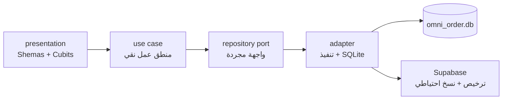
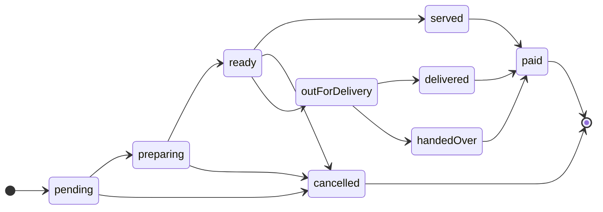

<div align="center">

# 🐟 Ocean Catch

**نظام إدارة مطاعم ومحلات متكامل — نقطة بيع، مخزون، مشتريات، وورديات، وتقارير**
يعمل **محليًا بالكامل** على SQLite بدون سيرفر، بواجهة عربية كاملة (RTL).

[](https://flutter.dev)
[](https://dart.dev)
[](https://www.sqlite.org)
[](https://docs.flutter.dev/reference/supported-platforms)
[](LICENSE)

`Android` · `iOS` · `Windows` · `macOS` · `Linux`

</div>

---

## المحتويات

- [نظرة سريعة](#نظرة-سريعة)
- [أبرز المزايا](#أبرز-المزايا)
- [التقنيات](#التقنيات)
- [البنية المعمارية](#البنية-المعمارية)
- [أقسام التطبيق والصلاحيات](#أقسام-التطبيق-والصلاحيات)
- [الأدوار والصلاحيات](#الأدوار-والصلاحيات)
- [دورة حياة الطلب وحساب الطاولة](#دورة-حياة-الطلب-وحساب-الطاولة)
- [التخزين والأمان](#التخزين-والأمان)
- [البداية السريعة](#البداية-السريعة)
- [البناء](#البناء)
- [الاختبارات](#الاختبارات)
- [ملاحظات](#ملاحظات)
- [الترخيص](#الترخيص)

---

## نظرة سريعة

| البند | القيمة |
| --- | --- |
| الإصدار الحالي | `1.0.0+1` |
| Flutter | `3.46` |
| Dart | `^3.11.5` |
| التخزين | SQLite محلي (`omni_order.db`، الإصدار `27`) |
| المعمارية | Clean Architecture على مستوى كل feature |
| اللغة | Dart 3.11 — تطبيق Flutter واحد لكل المنصات |
| الترجمة | عربية (RTL) — خط Cairo |
| الاختبارات | 102 اختبارًا ✅ `flutter analyze` نظيف |

## أبرز المزايا

### المخزون والمشتريات

- أصناف بتصنيفات ووحدات قياس متعددة (قطعة، كيلو، لتر، كرتونة، وجبة…).
- باركود، استيراد جماعي للأصناف، وتكلفة البضاعة.
- وصفات (Recipes) مرتبطة بالأصناف لحساب تكلفة الطبق.
- مشتريات الموردين، مدفوعات الموردين، ومرتجعات الموردين على المخزون.

### نقطة البيع والفواتير

- نقطة بيع سريعة: سلة، خصومات، ضرائب، وكميات.
- طرق دفع متعددة: نقدي، شبكة، محفظة، تحويل بنكي، مختلط، وآجل.
- فواتير PDF قابلة للطباعة والحفظ، وفواتير معلّقة (تعليق واسترجاع).
- عميل خارجي (Customer Display)، تقارير يومية، وسجل مبيعات كامل.
- دعم طابعة حرارية ESC/POS.

### الطلبات والمطبخ

- طلبات صالون مرتبطة بالطاولات، طلبات تليفريسي، وطلبات توصيل برسوم توصيل.
- شاشة مطبخ بحالات الطلب وسجل زمني لتغييرات الحالة.
- طابور انتظار، حجوزات، وإدارة صالات وترابيزات بحالات (فارغة/مشغولة/محجوزة/تنظيف).

### الحسابات والتقارير

- ورديات (Z-Report) مع إغلاق وردية وتقرير مفصّل لكل طريقة دفع.
- تقارير: صافي الربح، الأصناف الأكثر مبيعًا، المبيعات الآجلة، وتقارير يومية.
- مصروفات، عملاء مع أرصدة ومديونيات، وكوبونات خصم.
- توصيل: مندوبون، تسويات، وسلف مع حساب رصيد لكل مندوب، وإدارة موظفين وسلفهم.
- إعدادات المتجر، نسخ احتياطي واستعادة (محليًا أو من Supabase Storage).

## التقنيات

| المجال | الحزم |
| --- | --- |
| الحالة والتنقل | `flutter_bloc` · `equatable` |
| التخزين | `sqflite` · `sqflite_common_ffi` · `path_provider` |
| المزامنة السحابية | `supabase_flutter` · `connectivity_plus` |
| الفواتير والملفات | `pdf` · `open_filex` · `media_store_plus` |
| الطابعة الحرارية | `unified_esc_pos_printer` |
| الباركود والصور | `mobile_scanner` · `image_picker` |
| الأمان | `flutter_secure_storage` · `crypto` |
| الواجهة | `flex_color_scheme` · `intl` · `flutter_localizations` |

## البنية المعمارية



```text
lib/
├── app/        # composition root: AppDependencies
├── core/       # الثوابت، الثيم، الترجمة، الأدوات، الخدمات المشتركة
├── domain/     # النماذج المشتركة + واجهة StoreRepository
├── data/       # SQLite، الـ adapters، الخدمات
└── features/
    ├── auth/          ├── license/       ├── settings/
    ├── categories/    ├── orders/        ├── suppliers/
    ├── coupons/       ├── products/      ├── tables/
    ├── customers/     ├── queue/         ├── waiter/
    ├── delivery/      ├── recipes/
    ├── employees/     ├── reservations/
    ├── expenses/      ├── rider_balance/
    ├── halls/         ├── sales/
    ├── home/          ├── kitchen/
```

كل feature مقسّم إلى:

```text
features/<feature>/
├── domain/        # repository ports + use cases (منطق عمل نقي)
├── data/          # adapters تنفّذ ports وتستخدم SQLite
└── presentation/  # الشاشات والـ cubits
```

مسار الاعتماديات:

```text
presentation → use case → repository port → adapter → SQLite
```

- `lib/app/app_dependencies.dart` هو نقطة التركيب: ينشئ الـ adapters، ويوفّر الـ use cases
  عبر `RepositoryProvider`، وتستهلكها `lib/main.dart`.
- `lib/domain/repositories/store_repository.dart` واجهة توافق مؤقتة تُبقي الترحيل ممكنًا
  وتدعم `FakeStoreRepository` في الاختبارات، بينما تستخدم الـ cubits use cases مستقلة قدر الإمكان
  مع fallback متوافق.
- `LicenseService` استثناء معماري: يُبنى خارج `AppDependencies` لبوابة الترخيص.

## أقسام التطبيق والصلاحيات

| القسم | الصلاحية المطلوبة |
| --- | --- |
| نقطة البيع — طلب جديد | البيع |
| نقطة البيع — أوردر الدليفري | البيع |
| طلب من الترابيزة | البيع |
| المطبخ | متاح للجميع |
| الطلبات السابقة | سجل المبيعات |
| الفواتير الآجلة | سجل المبيعات |
| المنيو | المنيو والأصناف |
| الوصفات | البيع |
| الموردين | المصروفات |
| العملاء | سجل المبيعات |
| الحجوزات | سجل المبيعات |
| قائمة الانتظار | سجل المبيعات |
| الصالات | إدارة الصالات |
| الترابيزات | إدارة الترابيزات |
| الوردية | سجل المبيعات |
| التقارير | التقارير |
| المصروفات | المصروفات |
| الكوبونات | المصروفات |
| مندوبين التوصيل | إدارة الموظفين |
| الموظفين | إدارة الموظفين |

الصلاحيات تُطبَّق على مستوى إظهار القسم في الهيكل الثابت (`AppShell` + `IndexedStack`)،
فتبقى حالة كل شاشة محفوظة أثناء التنقل.

## الأدوار والصلاحيات

| الدور | الصلاحيات |
| --- | --- |
| `superAdmin` — أدمن أساسي | كل شيء + إدارة المستخدمين |
| `admin` — مدير | كل شيء عدا إدارة المستخدمين |
| `cashier` — كاشير | البيع، سجل المبيعات، إدارة الطلبات |
| `waiter` — جرسون | البيع، سجل المبيعات، إدارة الطلبات، إدارة الترابيزات |
| `chef` — شيف | سجل المبيعات |

## دورة حياة الطلب وحساب الطاولة



مساران منفصلان بعد `ready`: **الصالون** (`served`) و**التوصيل** (`outForDelivery`)، وكلاهما ينتهي
بـ `paid` عبر `payTable`. حالة `awaitingPayment` معرّفة في النظام وتُعامل على أنها **غير مسددة** في
واجهات الطلبات والطاولات، وتظهر للمستخدم إلى جانب الحالات أعلاه.

- `served` يعني قُدّم للعميل **ولم يُدفع بعد**، فيبقى على الطاولة ولا يدخل في طلبات التسديد.
- `payTable` يجمع الطلبات غير المسددة فقط
  (`NOT IN cancelled, paid, delivered, handedOver`)، يضع `paid` مع طريقة الدفع، يسجّل سجل
  الحالة، ويحرّر الطاولة — كل ذلك في transaction واحدة.
- الطاولة تبقى مشغولة ما دام هناك أي طلب غير مسدد عليها، وتُحرَّر بعد التسديد أو بعد إلغاء
  آخر طلب.
- تغيير حالة الطلب + سجل الحالة يتمّان في transaction واحدة، ولا يمكن إلغاء طلب تم تسديده.
- الانتقالات مُقيّدة على مستوى الـ use cases: `kitchen_usecases.dart` يمنع الخروج من أي حالة
  نهائية، و`delivery_usecases.dart` يسمح فقط بحالات التوصيل المعروفة.

## التخزين والأمان

- قاعدة البيانات: `omni_order.db` على SQLite، الإصدار `27`، مع ترحيل تدريجي
  (`onUpgrade`) في `lib/data/database/app_database.dart`.
- النسخ الاحتياطي: نسخة من ملف قاعدة البيانات (`omni_order_backup_*`) مع استعادة من الجهاز
  أو من Supabase Storage (bucket: `omni_order_backups`).
- كلمات سر الأدمن مخزّنة بـ PBKDF2-SHA256، ومفاتيح الترخيص في تخزين آمن
  (`flutter_secure_storage`).
- إعدادات Supabase في `lib/core/config/supabase_config.dart`. المفتاح الحالي من نوع
  `publishable` (مفتاح عام مخصص لتطبيقات العميل) — عند النشر يفضّل تمريره عبر
  `--dart-define` أو ملف إعدادات محلي غير متتبَّع بدل تثبيته في الكود.

## البداية السريعة

المتطلبات: Flutter `3.46` (أو أحدث) على `PATH`.

```bash
flutter pub get
flutter run
```

عند أول تشغيل يُنشأ حساب مدير من شاشة الإعداد الأولي. في وضع التطوير المحلي بدون Supabase
يعمل التطبيق مباشرة بلا بوابة ترخيص.

## البناء

```bash
flutter build apk --release         # Android APK
flutter build appbundle --release  # Android Play Store
flutter build ipa --release        # iOS
flutter build windows --release    # Windows
flutter build linux --release      # Linux
flutter build macos --release      # macOS
```

## الاختبارات

```bash
flutter analyze
flutter test
```

102 اختبارًا في 14 ملفًا تغطي: البيع والمخزون والضرائب وطرق الدفع، الصلاحيات والأدوار،
الاستمرارية بعد إعادة التشغيل، الورديات، الفواتير المعلّقة، تقارير المبيعات، ودورة حياة
الطلبات وحساب الطاولات (تكامل على SQLite حقيقي عبر FFI)، إضافة إلى اختبارات واجهة للشاشات
الأساسية واختبارات بوابة الترخيص.

## ملاحظات

- الاسم التجاري في الواجهة والمنصات: **Ocean Catch**. أما المعرفات التقنية (`omni_order` في
  `pubspec` والاستيرادات واسم قاعدة البيانات) فبقيت كما هي للحفاظ على توافق البيانات
  والنسخ الاحتياطية.
- ملفات تفريغ الذاكرة (`core.*`) وملفات البناء مستبعدة من Git عبر `.gitignore`.
- هياكل المنصات (`android/`, `ios/`, `windows/`, `macos/`, `linux/`) مضمّنة، ومجلد `web`
  هو القالب الافتراضي من Flutter (لم يُختبر كنشر فعلي بعد).

## الترخيص

هذا المشروع مرخّص تحت رخصة [MIT](LICENSE) — اقرأ ملف [LICENSE](LICENSE) للتفاصيل.
